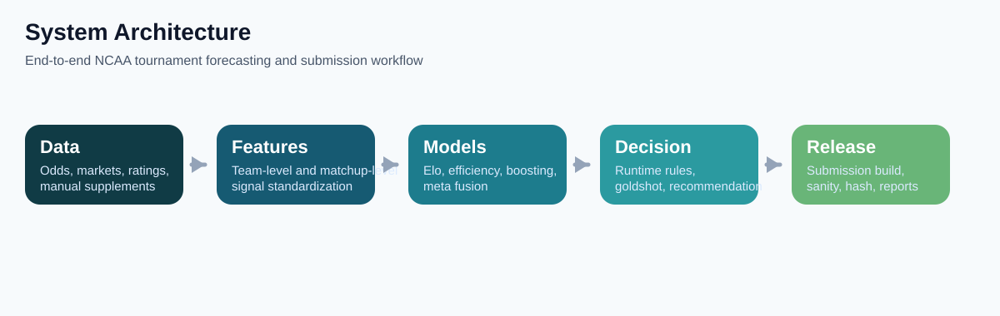
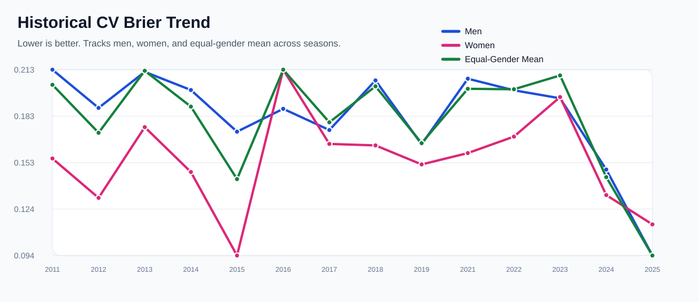
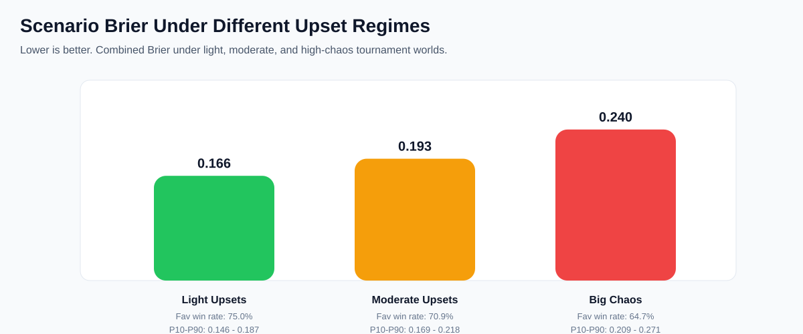

# NCAA Tournament Probabilistic Forecasting & Decision System

[](LICENSE)


[](https://github.com/riveeji/NCAA-Tournament-Probabilistic-Forecasting-Decision-System-)


面向 Kaggle NCAA March Machine Learning Mania 的端到端概率预测与决策系统。这个仓库不是单个 notebook，也不是单一模型导出脚本，而是一套完整的比赛工程：

- 多源数据接入与标准化
- team-level / matchup-level 特征构建
- men / women 分路径建模
- replay / benchmark / registry / official LB sanity check
- submission 构建、校验、归档与复盘

英文说明见 [README.en.md](README.en.md)。极简中文入口见 [README.zh-CN.md](README.zh-CN.md)。

## 当前状态

当前 production 主线已经冻结在 `JI_base`：

- frozen core: `core::lr_carry_elo_definition_v1`
- model family: `JI_lr_control`
- feature profile: `lr_carry_elo_definition_v1`
- alpha profile: `quality_only_men_quality_blocks_women`
- women quality profile: `consensus_rebuild_v4`
- 当前最好 official LB: `0.1231313`

对应阶段文档：

- [docs/JI_BASE_PHASE_STATUS.md](docs/JI_BASE_PHASE_STATUS.md)
- [docs/JI_NEXT_ARCH_PHASE1.md](docs/JI_NEXT_ARCH_PHASE1.md)

结论也已经比较明确：

- production core 已经很强
- 纯 backbone/head 创新基本进入平台期
- 下一阶段更可能来自更强的信息层，而不是继续替换主模型

## 项目图示

### 系统结构



### Replay / CV 趋势



### Upset 压力测试



## 这套系统解决什么问题

典型 Kaggle 方案往往只做两件事：训练模型、导出提交。这个仓库把问题拆成了更接近真实比赛运维的完整链路：

1. 数据层  
   聚合官方 NCAA 数据、外部 ratings、matchup projections、odds、prediction markets、injury / availability 等信号。
2. 特征层  
   统一 team-season、team-game、matchup 视角，构造 men / women 共享但可差异化的结构化特征。
3. 模型层  
   保留稳定核心模型，并允许 challenger、upstream、sidecar、next-arch 实验在隔离路径内验证。
4. 治理层  
   所有重要变更先过 replay gate，再决定是否生成 official LB sanity-check submission。
5. 发布层  
   统一生成候选 submission、摘要、hash、snapshot manifest 和文档化结论。

## 核心能力

- 同时支持 men's 与 women's tournament forecasting
- 面向 Kaggle `132,133` submission space 输出概率
- men / women 分路径建模与评估
- 统一治理 replay / benchmark / slice diagnostics / official sanity check
- 支持多类 external signals：
  - odds
  - prediction markets
  - public ratings
  - matchup projections
  - women historical consensus snapshots
- 支持研究分支：
  - `hc/next_arch` 用于 replay-first 新架构实验
  - `hc/ji_base` 用于稳定 production lane

## 已验证的主要结论

### 已 promotion 的结构升级

- `lr_pruned_core_v1`
- `lr_carry_elo_definition_v1`

### 已证伪或已暂停的方向

- `Colley` conference downweight
- `SRS` clipping
- women internal-only feature reshaping
- `TabR`
- `pairwise-only`
- `graph-only`
- standalone / hybrid transformer family
- 窄版 gender-specific stacker v1

### 当前研究判断

- 新 head / backbone 不是主要瓶颈
- 当前最值得继续的长期方向是 richer sidecars / upstream signals
- 但这些方向需要更完整的历史与 current-year 外部数据覆盖，不能靠弱 sidecar 反复试错

## 仓库结构

```text
.
|-- hc/
|   |-- ji_base/            # 当前冻结的 production core
|   |-- next_arch/          # replay-first 新架构实验
|   |-- gold/               # 历史/基线相关路径
|   `-- v2/                 # v2 rebuild / replay lane
|-- tools/                  # 数据抓取、构建、benchmark、submission、source snapshots
|-- tests/                  # 针对 production / experiments / builders 的测试
|-- docs/                   # 阶段文档、benchmark、specs、plans
|   `-- assets/             # README 图示资源
|-- results/                # 受控摘要与复盘产物（大部分生成物默认不入库）
|-- zizzii_features.py      # 历史主链兼容逻辑
|-- README.md
`-- README.en.md
```

## 关键文档

- [docs/JI_BASE_PHASE_STATUS.md](docs/JI_BASE_PHASE_STATUS.md)  
  当前 production 主线、冻结范围、已 promotion / 已暂停方向
- [docs/JI_NEXT_ARCH_PHASE1.md](docs/JI_NEXT_ARCH_PHASE1.md)  
  `TabR` / `pairwise` / `graph` / `transformer` / stacker 等新架构 replay 结论
- [docs/JI_BASE_BENCHMARK.md](docs/JI_BASE_BENCHMARK.md)  
  core challenger benchmark 汇总
- [docs/JI_BASE_WOMEN_SLICE_DIAGNOSTICS.md](docs/JI_BASE_WOMEN_SLICE_DIAGNOSTICS.md)  
  women slice 诊断
- [docs/INTERVIEW_NOTES.zh-CN.md](docs/INTERVIEW_NOTES.zh-CN.md)  
  面试表达版本

## 快速开始

### 1. 创建环境

```powershell
python -m venv .venv
.\.venv\Scripts\Activate.ps1
pip install -r requirements-hc.txt
```

### 2. 运行 replay / postmortem

```powershell
.\.venv\Scripts\python.exe tools\run_v2_baseline_replay.py
.\.venv\Scripts\python.exe tools\build_postmortem_report.py
```

### 3. 运行 `JI_base` challenger

```powershell
.\.venv\Scripts\python.exe tools\run_ji_base_challenger.py --candidate-name core::women_ranking_historical_snapshots_v1
```

### 4. 运行 next-arch challenger

```powershell
.\.venv\Scripts\python.exe tools\run_next_arch_challenger.py --candidate-name arch::gender_specific_stacker_v1
```

## 数据与复现说明

GitHub 公开仓库默认**不提交**以下目录：

- `external-data/`
- `ncaa-data/`
- 大多数 `results/` 生成物
- 本地 submission CSV

原因很简单：

- 体积大
- 部分源有授权/时点限制
- 大量文件属于本地缓存和实验产物，不适合直接入库

因此这个公开仓库更偏向：

- 保留源码
- 保留流程
- 保留关键摘要和阶段结论

而不是完整数据 dump。

## 为什么这个仓库值得看

- 它不是“一个模型”，而是一套**完整的比赛系统**
- men / women 分路径设计是第一公民，而不是后补
- 强调 replay gate、registry、official sanity check，而不是只看单次 leaderboard
- 明确区分 production lane 和 research lane
- 很适合作为：
  - Kaggle 系统工程案例
  - sports analytics 工程案例
  - probabilistic forecasting / calibration 项目案例
  - ML 平台化与实验治理案例

## 下一阶段方向

当前最合理的路线不是继续堆新 backbone，而是：

- 冻结现有 production core
- 补 richer sidecars / upstream 数据
- 在赛季前重开：
  - men player-level injury / value sidecar
  - market / prediction-market sidecar
  - stronger women upstream
  - gender-specific stacking

## License

Released under the [MIT License](LICENSE).
